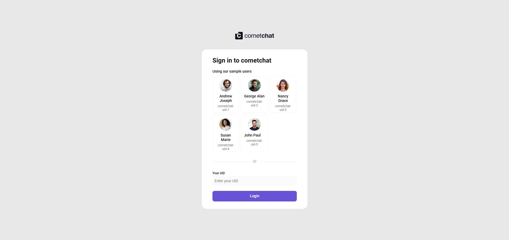
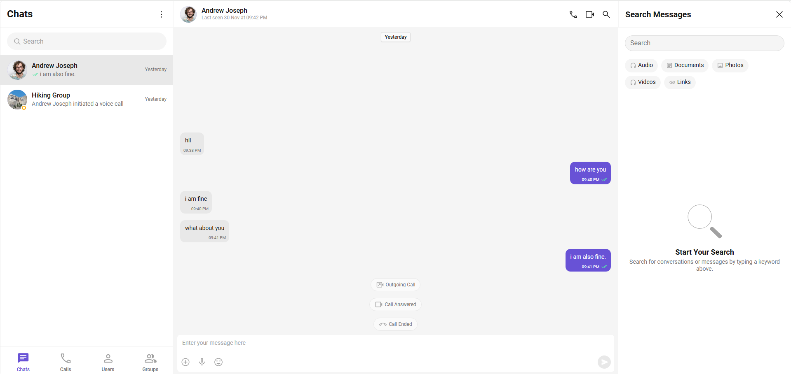
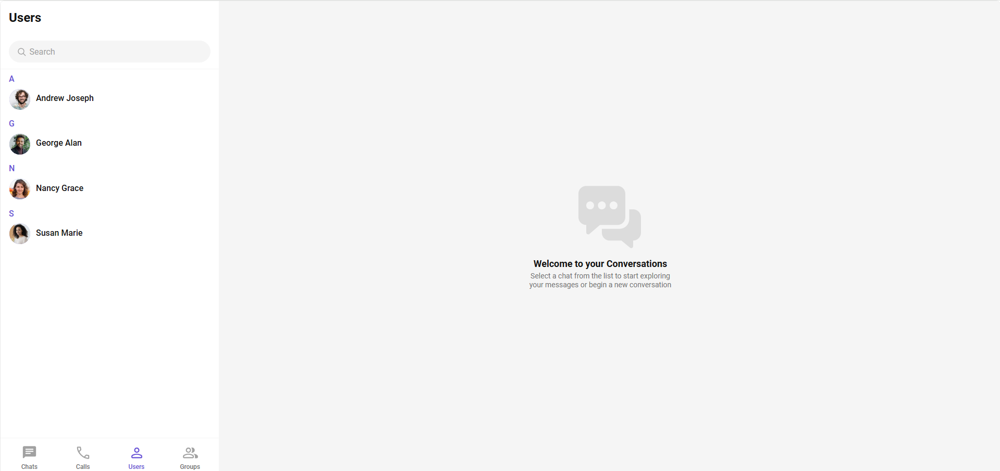
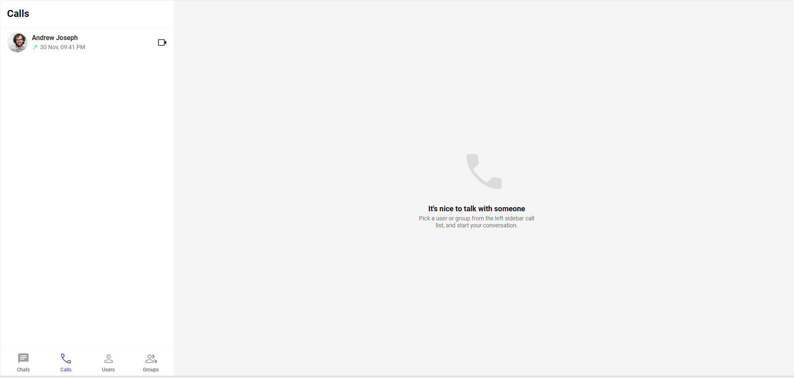

# 🌟 CometChat Internship Task – React UI Kit Implementation

This repository contains my submission for the **CometChat Internship Assignment**.  
I explored the CometChat Dashboard, used the **UI Kit Builder**, generated a React project, implemented it locally, and documented all bugs, issues, and improvement suggestions.

---

## 📝 **Project Summary**

- Implemented **CometChat React UI Kit** generated from the UI Kit Builder.
- Successfully integrated:
  - Authentication
  - Chats
  - Users
  - Groups
  - Calls
  - Themes & Layout configurations
- Validated that the auto-generated project runs successfully.
- Documented all findings in the `/docs/cometchat_review.pdf`

---

## 🚀 **Getting Started**

Follow these steps to run the project locally:

### 🔧 1. Install Dependencies

```bash
npm install --legacy-peer-deps
```

### ▶️ 2. Start the Development Server

```bash
npm start
```

The project will run at:

```
http://localhost:3000
```

---

## 📸 **Screenshots**

Below are screenshots captured during implementation and testing.

### 🔐 Login Screen



### 💬 Chats



### 👥 Users List



### 👨‍👩‍👧 Groups


### 📞 Calls



---

## 🎥 **Screen Recording**

A full walkthrough of the implemented UI Kit:

👉 [Click to watch recording](./screenshot/recording.mp4)

---

## 📂 **Folder Structure**

```
cometchat-app-react/
│
├── docs/
│   └── cometchat_review.pdf
│
├── screenshot/
│   ├── calls.png
│   ├── chats.png
│   ├── goups.png
│   ├── login.png
│   ├── users.png
│   ├── recording.mp4
│
├── src/
│   ├── components/
│   └── App.js
│
├── package.json
└── README.md
```

---

## 📄 **Review Document**

A detailed PDF with:

- Dashboard review
- UI Kit Builder evaluation
- Documentation issues
- Implementation issues
- Improvement suggestions

📌 Included here:  
`/docs/cometchat_review.pdf`

---

## 👤 Author

**Noorain SK**
